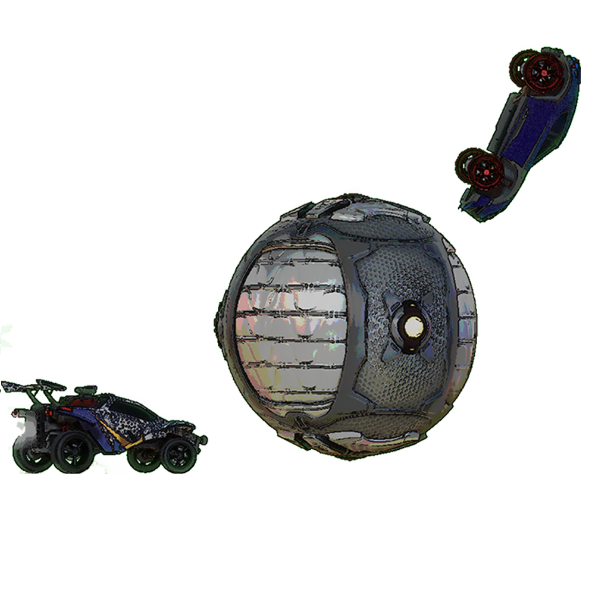

# rlbot-attack-defender
A rlbot script to let you play against yourself, both as a attacker and a defender in rocket league

  

---
## Usage
- Download this thing as a zip, and extract it somewhere
- In rlbot, Click on add, then load folder, then select the extracted bot folder
- 
- Then, enable the script, and start the game, keeping the teams empty, except for one human in the blue team
  (you can fill up the teams, but they will not show up in the match)

---
## Credits:
- Darxeal - This script is basically a modification to their [Quantum League](https://github.com/Darxeal/quantum-league) script, which you can play on rlbot as well!
